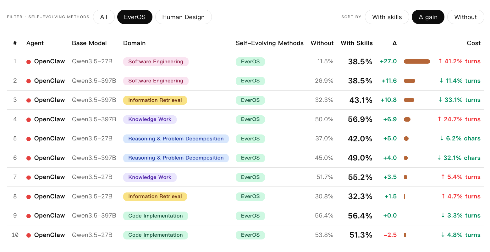

# EvoAgentBench

[](https://evermind-ai.github.io/EvoAgentBench/)
<!-- [](https://arxiv.org/abs/xxxx.xxxxx) -->
[](https://huggingface.co/datasets/EverMind-AI/EvoAgentBench)
[](LICENSE)

**统一的 AI Agent 自进化评测框架，覆盖多任务领域。**

EvoAgentBench 提供标准化的评测流程，用于对比 agent 自进化方法 —— 即让 agent 从过去的经验中学习、提升未来表现的技术。框架提供了 domain、agent、skill 评估方法的可插拔抽象，便于评估不同自进化方法在信息检索、推理与问题分解、软件工程、代码实现、知识工作等领域的泛化能力。

**核心特性：**

- **多领域评测** — 5 个评测维度，统一评测流程
- **多 Agent 支持** — 可插入任何 CLI 形式的 agent（nanobot、openclaw 或自定义）
- **自进化对比** — 标准化的 训练/提取/评测 协议，用于 skill-based 方法对比

<p align="center">
  
</p>

*部分评测结果：各领域和 agent 在有/无 skill 注入下的 pass rate。"Δ gain" 为自进化方法带来的绝对提升。更多结果 coming soon。*

## 目录

- [评测领域](#评测领域)
- [自进化方法](#自进化方法)
- [Agents](#agents)
- [前置准备](#前置准备)
  - [数据集](#数据集)
  - [环境安装](#环境安装)
  - [Agent 配置](#agent-配置)
- [快速开始](#快速开始)
- [示例](#示例)
- [参考](#参考)

## 评测领域

EvoAgentBench 基于已有 benchmark 数据，按领域进行分簇（cluster），构建 train/test split，用于自进化方法的训练和评测。

| 领域 | 基础 Benchmark | 说明 | 分簇 | Train | Test |
|------|---------------|------|------|-------|------|
| 信息检索 | BrowseCompPlus | 搜索本地语料库，回答多约束复杂问题 | 10 clusters（按主题） | 154 | 65 |
| 推理与问题分解 | OmniMath | 解决多学科竞赛级数学题 | 按数学子学科 | 478 | 100 |
| 工程问题解决 | SWE-Bench | 修复开源 Python 项目中的真实 bug | 19 clusters（按 repo） | 101 | 26 |
| 代码实现 | LiveCodeBench | 解决竞赛编程题，代码执行验证 | 39 clusters（按类型） | 97 | 39 |
| 知识工作交付 | GDPVal | 完成真实职业工作任务 | 29 clusters（按职业） | 87 | 58 |

## 自进化方法

EvoAgentBench 提供标准化的自进化方法评测协议 —— 从 agent 历史轨迹中提取可复用知识（skill），注入后提升未来表现。支持两种评测模式：

**离线模式（Offline）**：先在训练集上收集 agent 轨迹，批量提取 skill，再在测试集上注入 skill 评测。进化和评测分阶段进行。

**在线模式（Online）**：agent 在执行任务的同时实时提取 skill 并更新知识库，后续任务自动利用已积累的 skill。进化和评测同时进行，模拟真实场景下的持续学习。

| 方法 | 说明 | 链接 |
|------|------|------|
| **EverMemOS** | 基于记忆的轨迹 skill 提取 | [github.com/EverMind-AI/EverOS](https://github.com/EverMind-AI/EverOS) |
| **EvoSkill** | 两步式 proposer-generator 自改进循环 | [github.com/sentient-agi/EvoSkill](https://github.com/sentient-agi/EvoSkill) |
| **Memento** | 基于案例检索的相似度搜索 | [github.com/Agent-on-the-Fly/Memento](https://github.com/Agent-on-the-Fly/Memento) |
| **OpenSpace** | 通过 analyze-evolve 管线积累 skill | [github.com/HKUDS/OpenSpace](https://github.com/HKUDS/OpenSpace) |
| **Reasoning Bank** | 可复用推理模式库 | [github.com/google-research/reasoning-bank](https://github.com/google-research/reasoning-bank) |

## Agents

支持两个 agent，通过 CLI 子进程调用，每个 task 独立隔离：

- **nanobot** (Python) — `pip install nanobot==0.1.4.post3`
- **openclaw** (Node.js) — `npm install -g openclaw@2026.3.24`

## 前置准备

### 数据集

所有评测数据可从 [HuggingFace](https://huggingface.co/datasets/EverMind-AI/EvoAgentBench) 下载：

```bash
huggingface-cli download EverMind-AI/EvoAgentBench --repo-type dataset --local-dir ./data
```

下载后将数据放在 `data/` 目录下，或在各评测维度的 yaml 配置中更新路径。

### 环境安装

```bash
# 方式一：Conda（推荐，包含 JDK 等系统依赖）
conda env create -f environment.yml
conda activate evoagentbench

# 方式二：pip + venv（需自行安装 JDK 21+）
python3 -m venv .venv && source .venv/bin/activate
pip install -r requirements.txt

# JDK 21 安装（方式二需要，BrowseComp-Plus 的 BM25 搜索依赖 pyserini/JVM）
apt install openjdk-21-jdk        # Ubuntu/Debian
# 或 yum install java-21-openjdk  # CentOS/RHEL
```

flash-attn 不需要安装。BrowseCompPlus 的 embedding 模型默认使用 eager attention。

### Agent 配置

从 `.yaml.example` 复制并编辑，主要设置 model 和 provider（详见 example 文件注释）：

```bash
cp src/agents/nanobot/nanobot.yaml.example src/agents/nanobot/nanobot.yaml
```

在 `config.yaml` 中切换 agent：

```yaml
agent: nanobot    # 改成 openclaw 即可切换
```

## 快速开始

前提：已完成安装，nanobot 可用。

```bash
# 1. 验证 agent 可用
nanobot agent --message "hello"

# 2. 配置
cp config.yaml.example config.yaml
cp .env.example .env                  # 填写 API keys
cp src/agents/nanobot/nanobot.yaml.example src/agents/nanobot/nanobot.yaml
# 编辑 nanobot.yaml：设置 model/provider（默认：OpenRouter Qwen 3.5-27B）

# 3. 运行单个任务
python src/run.py --agent nanobot --domain software_engineering --task astropy__astropy-12907 --live
```

## 示例

```bash
# SWE-bench：修复 astropy separability_matrix bug（单行修复）
python src/run.py --agent nanobot --domain software_engineering --task astropy__astropy-12907 --live

# BrowseComp-Plus：搜索本地语料库并回答问题
python src/run.py --agent nanobot --domain information_retrieval --task 784 --live

# GDPVal：Excel 数据审计分析
python src/run.py --agent nanobot --domain knowledge_work --split train --task 83d10b06-26d1-4636-a32c-23f92c57f30b --live

# LiveCodeBench：竞赛编程
python src/run.py --agent nanobot --domain code_implementation --task 1873_A --live

# OmniMath：数学解题
python src/run.py --agent nanobot --domain reasoning --split test --task omni_917 --live
```

### EverMemOS 使用流程

```bash
# 第一步：跑训练任务（baseline，无 skill）
python src/run.py --domain information_retrieval --split train --parallel 4

# 第二步：从训练 session 中提取 skill（需要 EverMemOS 服务）
python src/skill_evolution/evermemos/extract_skills.py --domain information_retrieval

# 第三步：带 skill 注入评估测试集
python src/skill_evolution/evermemos/eval_with_skills.py --domain information_retrieval

# 第四步：对比 baseline
python src/run.py --domain information_retrieval --split test --parallel 4 --job baseline
```

## 参考

### CLI 参数

| 参数 | 配置来源 | 说明 |
|------|---------|------|
| `--config` | — | 配置文件路径 |
| `--agent` | config.yaml `agent` | Agent 名称 |
| `--domain` | config.yaml `domain.name` | Domain 名称 |
| `--split` | domain yaml `split` | 数据划分（train/test/all/cluster 名） |
| `--task` | domain yaml `task` | 指定 task ID（逗号分隔） |
| `--job` | 自动生成 | Job 名称 |
| `--trials` | config.yaml `trials` | 每个 task 跑几次（pass@k） |
| `--parallel` | config.yaml `parallel` | 最大并行数 |
| `--live` | config.yaml `live` | 实时显示 agent 工具调用 |
| `--disk-budget` | config.yaml `disk_budget` | 磁盘预算：`auto`、`25G`、`10240M` |

### 特殊配置

- **BrowseComp-Plus**：需要构建 FAISS 索引 — `python src/utils/browsecomp-plus-tools/setup_data.py`。详见 [README](src/domains/information_retrieval/README.md)。
- **GDPVal**：需要 `poppler-utils`（PDF）和可选的 `libreoffice`（PPTX）。详见 [README](src/domains/knowledge_work/README.md)。
- **SWE-bench**：需要 Docker 用于容器化评测。容器需要访问 PyPI/GitHub（eval 脚本在运行时安装测试依赖），`http_proxy`/`https_proxy` 环境变量会自动转发。
- **LiveCodeBench**：需要单独安装（存在依赖冲突）：`git clone https://github.com/LiveCodeBench/LiveCodeBench.git && pip install --no-deps -e ./LiveCodeBench`。详见 [README](src/domains/code_implementation/README.md)。

### 输出格式

```
jobs/{job_name}/
├── {task}__trial_1/
│   ├── result.json             # 完整结果（reward, turns, tokens, elapsed）
│   ├── session.jsonl           # Agent session 轨迹
│   └── verifier/
│       ├── reward.txt          # 分数
│       ├── details.json        # [information_retrieval] LLM Judge 详情
│       ├── agent_patch.diff    # [software_engineering] 代码修改
│       └── ...                 # 各评测维度特定输出
├── {task}__trial_1_retry1/     # 重试备份
└── summary.json                # 汇总指标
```

### 项目结构

```
evoagentbench/
├── config.yaml.example             # 配置模板
├── .env.example                    # 环境变量模板
├── requirements.txt                # Python 依赖
├── environment.yml                 # Conda 环境
├── src/
│   ├── run.py                      # 入口
│   ├── runner.py                   # 执行引擎（trial、retry、调度）
│   ├── config.py                   # 配置加载 + 注册
│   ├── agents/
│   │   ├── base.py                 #   AgentAdapter 基类
│   │   ├── nanobot/                #   Nanobot adapter
│   │   └── openclaw/               #   OpenClaw adapter
│   ├── domains/
│   │   ├── base.py                 #   DomainAdapter 基类
│   │   ├── information_retrieval/  #   信息检索（BrowseCompPlus）
│   │   ├── reasoning/              #   推理与问题分解（OmniMath）
│   │   ├── software_engineering/   #   工程问题解决（SWE-Bench）
│   │   ├── code_implementation/    #   代码实现（LiveCodeBench）
│   │   └── knowledge_work/         #   知识工作交付（GDPVal）
│   └── utils/
│       ├── summary.py              #   结果聚合
│       ├── docker.py               #   Docker + tmux 工具
│       └── browsecomp-plus-tools/  #   BrowseComp-Plus MCP server + 数据准备
├── src/skill_evolution/                           # 自进化方法评估
│   └── evermemos/                  #   EverMemOS skill 提取 + 评估
├── data/                           # 评测数据（gitignored）
└── jobs/                           # 评测输出（gitignored）
```

### License

Apache 2.0. 详见 [LICENSE](LICENSE)。
