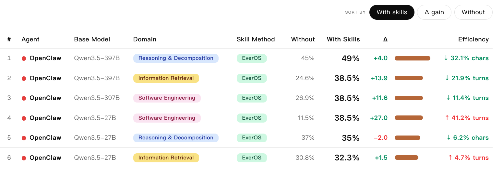

# EvoAgentBench

<!-- [](https://xxx) -->
<!-- [](https://arxiv.org/abs/xxxx.xxxxx) -->
[](https://huggingface.co/datasets/EverMind-AI/EvoAgentBench)
[](LICENSE)

**A unified evaluation framework for evaluating AI agent self-evolution across diverse task domains.**

EvoAgentBench enables standardized comparison of agent self-evolution methods — techniques that allow agents to improve their performance by learning from past experience. It provides pluggable abstractions for domains, agents, and skill evaluation methods, making it easy to evaluate how different self-evolution approaches generalize across information retrieval, reasoning, software engineering, code implementation, and knowledge work.

**Key features:**

- **Multi-domain evaluation** — 5 evaluation domains with unified pipeline
- **Multi-agent support** — plug in any CLI-based agent (nanobot, openclaw, or your own)
- **Self-evolution comparison** — standardized train/extract/evaluate protocol for skill-based methods

<p align="center">
  
</p>

*Evaluation results: pass rate with and without skill injection across domains and agents. "Δ gain" shows absolute improvement from self-evolution methods.*

## Table of Contents

- [Evaluation Domains](#evaluation-domains)
- [Self-Evolution Methods](#self-evolution-methods)
- [Agents](#agents)
- [Prerequisites](#prerequisites)
  - [Dataset](#dataset)
  - [Installation](#installation)
  - [Agent Configuration](#agent-configuration)
- [Quick Start](#quick-start)
- [Examples](#examples)
- [Reference](#reference)

## Evaluation Domains

EvoAgentBench builds on existing benchmarks by clustering tasks into domains with train/test splits for self-evolution training and evaluation.

| Domain | Base Benchmark | Description | Clusters | Train | Test |
|--------|---------------|-------------|----------|-------|------|
| Information Retrieval | BrowseCompPlus | Search a local corpus to answer complex multi-constraint questions | 10 (by topic) | 154 | 65 |
| Reasoning & Problem Decomposition | OmniMath | Solve competition-level math problems across multiple subdisciplines | By subdiscipline | 478 | 100 |
| Software Engineering | SWE-Bench | Fix real-world bugs in open-source Python repositories | 19 (by repo) | 101 | 26 |
| Code Implementation | LiveCodeBench | Solve competitive programming problems with code execution | 39 (by type) | 97 | 39 |
| Knowledge Work | GDPVal | Perform real-world occupational tasks | 29 (by occupation) | 87 | 58 |

## Self-Evolution Methods

EvoAgentBench provides a standardized protocol for evaluating agent self-evolution methods — techniques that extract reusable knowledge (skills) from past agent trajectories and inject them to improve future performance. Two evaluation modes are supported:

**Offline mode**: Collect agent trajectories on the train split, batch-extract skills, then evaluate on the test split with skills injected. Evolution and evaluation happen in separate stages.

**Online mode**: The agent extracts skills in real-time while executing tasks, updating its knowledge base continuously. Subsequent tasks automatically leverage accumulated skills. Evolution and evaluation happen simultaneously, simulating continuous learning in real-world scenarios.

| Method | Approach | Link |
|--------|----------|------|
| **EverMemOS** | Memory-based skill extraction from trajectories | [github.com/EverMind-AI/EverOS](https://github.com/EverMind-AI/EverOS) |
| **EvoSkill** | Two-step proposer-generator self-improving loop | [github.com/sentient-agi/EvoSkill](https://github.com/sentient-agi/EvoSkill) |
| **Memento** | Case-based retrieval with similarity search | [github.com/Agent-on-the-Fly/Memento](https://github.com/Agent-on-the-Fly/Memento) |
| **OpenSpace** | Skill accumulation via analyze-evolve pipeline | [github.com/HKUDS/OpenSpace](https://github.com/HKUDS/OpenSpace) |
| **Reasoning Bank** | Reusable reasoning pattern library | [github.com/google-research/reasoning-bank](https://github.com/google-research/reasoning-bank) |

## Agents

Two agents supported, invoked as CLI subprocesses with per-task isolation:

- **nanobot** (Python) — `pip install nanobot==0.1.4.post3`
- **openclaw** (Node.js) — `npm install -g openclaw@2026.3.24`

## Prerequisites

### Dataset

All evaluation data can be downloaded from [HuggingFace](https://huggingface.co/datasets/EverMind-AI/EvoAgentBench):

```bash
huggingface-cli download EverMind-AI/EvoAgentBench --repo-type dataset --local-dir ./data
```

After download, place data under `data/` or update paths in each domain's yaml config.

### Installation

```bash
# Option 1: Conda (recommended, includes JDK and system deps)
conda env create -f environment.yml
conda activate evoagentbench

# Option 2: pip + venv (requires JDK 21+ installed separately)
python3 -m venv .venv && source .venv/bin/activate
pip install -r requirements.txt

# JDK 21 install (needed for Option 2, BrowseComp-Plus BM25 search uses pyserini/JVM)
apt install openjdk-21-jdk        # Ubuntu/Debian
# or: yum install java-21-openjdk # CentOS/RHEL
```

flash-attn is not required. The BrowseCompPlus embedding model uses eager attention by default.

### Agent Configuration

Copy from `.yaml.example` and edit to set model and provider (see example file comments for details):

```bash
cp src/agents/nanobot/nanobot.yaml.example src/agents/nanobot/nanobot.yaml
```

Switch agents in `config.yaml`:

```yaml
agent: nanobot    # change to openclaw to switch
```

## Quick Start

Prerequisite: installation completed, nanobot works.

```bash
# 1. Verify agent works
nanobot agent --message "hello"

# 2. Setup config
cp config.yaml.example config.yaml
cp .env.example .env                  # fill in API keys
cp src/agents/nanobot/nanobot.yaml.example src/agents/nanobot/nanobot.yaml
# Edit nanobot.yaml: set model/provider (default: OpenRouter Qwen 3.5-27B)

# 3. Run a single task
python src/run.py --agent nanobot --domain software_engineering --task astropy__astropy-12907 --live
```

## Examples

```bash
# SWE-bench: fix astropy separability_matrix bug (1 line fix)
python src/run.py --agent nanobot --domain software_engineering --task astropy__astropy-12907 --live

# BrowseComp-Plus: search local corpus and answer questions
python src/run.py --agent nanobot --domain information_retrieval --task 784 --live

# GDPVal: audit analysis on Excel data
python src/run.py --agent nanobot --domain knowledge_work --split train --task 83d10b06-26d1-4636-a32c-23f92c57f30b --live

# LiveCodeBench: competitive programming
python src/run.py --agent nanobot --domain code_implementation --task 1873_A --live

# OmniMath: math problem solving
python src/run.py --agent nanobot --domain reasoning --split test --task omni_917 --live
```

### EverMemOS Usage

```bash
# Step 1: Baseline — run agent on train split
python src/run.py --domain information_retrieval --split train --parallel 4

# Step 2: Extract skills from train sessions (requires EverMemOS service)
python src/skill_evolution/evermemos/extract_skills.py --domain information_retrieval

# Step 3: Evaluate test with skills injected
python src/skill_evolution/evermemos/eval_with_skills.py --domain information_retrieval

# Step 4: Baseline comparison
python src/run.py --domain information_retrieval --split test --parallel 4 --job baseline
```

## Reference

### CLI Parameters

| Parameter | Config Source | Description |
|-----------|-------------|-------------|
| `--config` | — | Config file path |
| `--agent` | config.yaml `agent` | Agent name |
| `--domain` | config.yaml `domain.name` | Domain name |
| `--split` | domain yaml `split` | Data split (train/test/all/cluster name) |
| `--task` | domain yaml `task` | Specific task ID(s), comma-separated |
| `--job` | auto-generated | Job name |
| `--trials` | config.yaml `trials` | Trials per task (for pass@k) |
| `--parallel` | config.yaml `parallel` | Max concurrent tasks |
| `--live` | config.yaml `live` | Show live agent tool calls |
| `--disk-budget` | config.yaml `disk_budget` | Disk budget: `auto`, `25G`, `10240M` |

### Domain-Specific Notes

- **BrowseComp-Plus**: requires FAISS index build — `python src/utils/browsecomp-plus-tools/setup_data.py`. See [README](src/domains/information_retrieval/README.md).
- **GDPVal**: requires `poppler-utils` (PDF) and optionally `libreoffice` (PPTX). See [README](src/domains/knowledge_work/README.md).
- **SWE-bench**: requires Docker for container-based evaluation. Containers need internet access to PyPI/GitHub (eval scripts install test dependencies at runtime). `http_proxy`/`https_proxy` env vars are forwarded automatically.
- **LiveCodeBench**: requires separate install (has conflicting deps): `git clone https://github.com/LiveCodeBench/LiveCodeBench.git && pip install --no-deps -e ./LiveCodeBench`. See [README](src/domains/code_implementation/README.md).

### Output Format

```
jobs/{job_name}/
├── {task}__trial_1/
│   ├── result.json             # Full result (reward, turns, tokens, elapsed)
│   ├── session.jsonl           # Agent session trajectory
│   └── verifier/
│       ├── reward.txt          # Score
│       ├── details.json        # [information_retrieval] LLM Judge details
│       ├── test_stdout.txt     # [software_engineering] test output
│       ├── agent_patch.diff    # [software_engineering] Code changes
│       └── fact_result.json    # [deepresearch] Citation accuracy
├── {task}__trial_1_retry1/     # Retry backup
└── summary.json                # Aggregated metrics
```

### Project Structure

```
evoagentbench/
├── config.yaml.example             # Config template
├── .env.example                    # Environment variables template
├── requirements.txt                # Python dependencies
├── environment.yml                 # Conda environment
├── src/
│   ├── run.py                      # Entry point
│   ├── runner.py                   # Execution engine (trial, retry, scheduling)
│   ├── config.py                   # Config loading + registry
│   ├── agents/
│   │   ├── base.py                 #   AgentAdapter base class
│   │   ├── nanobot/                #   Nanobot adapter
│   │   └── openclaw/               #   OpenClaw adapter
│   ├── domains/
│   │   ├── base.py                 #   DomainAdapter base class
│   │   ├── information_retrieval/  #   Information Retrieval (BrowseCompPlus)
│   │   ├── reasoning/              #   Reasoning & Problem Decomposition (OmniMath)
│   │   ├── software_engineering/   #   Software Engineering (SWE-Bench)
│   │   ├── code_implementation/    #   Code Implementation (LiveCodeBench)
│   │   └── knowledge_work/         #   Knowledge Work (GDPVal)
│   └── utils/
│       ├── summary.py              #   Result aggregation
│       ├── docker.py               #   Docker + tmux utilities
│       └── browsecomp-plus-tools/  #   BrowseComp-Plus MCP server + data prep
├── src/skill_evolution/                           # Self-evolution method evaluation
│   └── evermemos/                  #   EverMemOS skill extraction + evaluation
├── data/                           # Benchmark data (gitignored)
└── jobs/                           # Evaluation output (gitignored)
```

### License

Apache 2.0. See [LICENSE](LICENSE) for details.
